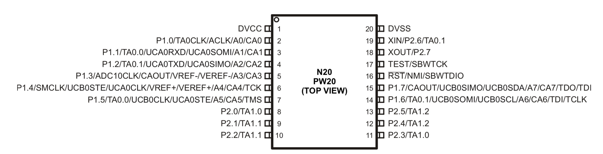
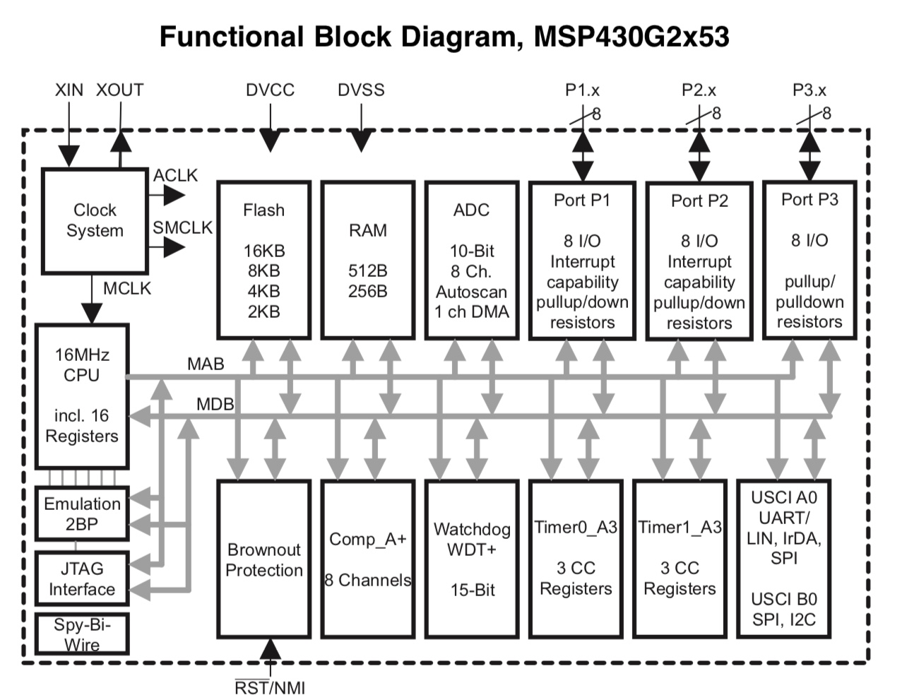
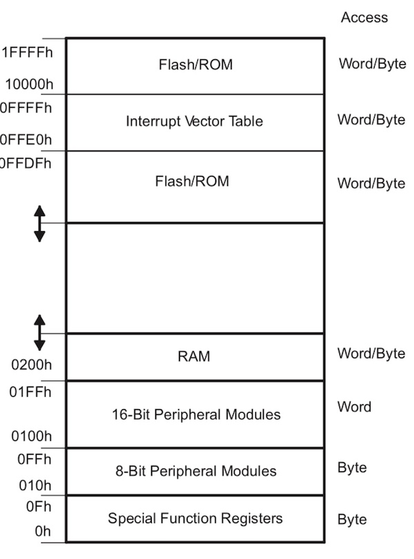

# EECS 346 MSP430 Overview and Setup Guide

This guide gives a brief overview of the Texas Instruments MSP430 and shows how to get simple programs running on the [MSP-EXP430G2 launchpad](http://www.ti.com/tool/MSP-EXP430G2), which is a combined programmer and breakout board for the MSP430

## MSP430 Overview
The Texas Instruments MSP430 family of ultra-low-power microcontrollers consists of several devices featuring different sets of peripherals targeted for various applications. The architecture, combined with five low-power modes, is optimized to achieve extended battery life in portable measurement applications. The device features a 16-bit RISC CPU, 16-bit registers, and constant generators. The digitally controlled oscillator (DCO) allows wake-up from low-power modes to active mode in less than 1 µs.

The [MSP430G2553](http://www.ti.com/product/msp430g2553) we are using has built-in 16-bit timers, up to 24 I/O capacitive-touch enabled pins, a versatile analog comparator, and built-in communication capability using the universal serial communication interface. In addition the MSP430G2x53 family members have a 10-bit analog-to-digital (A/D) converter. Below is the pinout, the [MSP430 launchpad pinout can be found here.](http://energia.nu/wordpress/wp-content/uploads/2014/01/LaunchPads-MSP430G2-%E2%80%94-Pins-Maps-13-42.jpeg)

The MSP430 incorporates a 16-bit RISC CPU, peripherals, and a flexible clock system that interconnect using a von-Neumann common memory address bus (MAB) and memory data bus (MDB). Partnering a modern CPU with modular memory-mapped analog and digital peripherals, 

Key features of the MSP430x2xx family include:

- Ultralow-power architecture extends battery life
- 0.1 μA RAM retention
- 0.8 μ A real-time clock mode
- 250 μA/MIPS active
- High-performance analog ideal for precision measurement
- Comparator-gated timers for measuring resistive elements
- 16-bit RISC CPU enables new applications at a fraction of the code size.
- Large register file eliminates working file bottleneck
- Compact core design reduces power consumption and cost
- Optimized for modern high-level programming
- Only 27 core instructions and seven addressing modes
- Extensive vectored-interrupt capability
- In-system programmable Flash permits flexible code changes, field upgrades and data logging

The MSP430 von-Neumann architecture has one address space shared with special function registers (SFRs), peripherals, RAM, and Flash/ROM memory as shown in Figure 1-2. See the device-specific data sheets for specific memory maps. Code access are always performed on even addresses. Data can be accessed as bytes or words.

## Development Environment (DevEnv) Setup

You will need to setup the development environment and toolchain for MSP430s. First you need to setup the compiler so that you can write C-code that can be compiled and run on an MSP430. Then you will need to setup the interface for the programmer (mspdebug) to load binary files onto your MSP430 device. Some of these steps are platform dependant.  

### Compiling MSP430 Programs
[Download the compiler (GCC) for your platform.](http://software-dl.ti.com/msp430/msp430_public_sw/mcu/msp430/MSPGCC/latest/index_FDS.html)

Build the Blink example. 

### OSX Setup

Install drivers for your platform.

Install mspdebug dependancies, build mspdebug.

Verify mspdebug can access your launchpad.

Flash the Blink example onto your MSP430 Launchpad using mspdebug.

### Linux Setup

### Windows Setup

### Debugging

(Optional) Step through the blink example using mspdebug.

## Other Resources

Liux, Makefiles, GCC, GDB